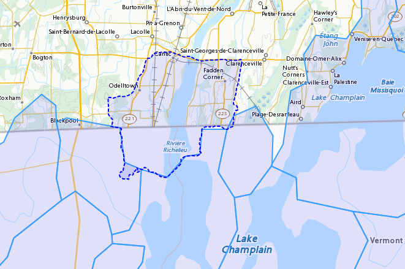

# Groundwater Surface Water Interoperability Pilot - SELFIE Demonstration

## Use Case Description

Link various heterogeneous datasets from various sources under a common water ontology using linked data across Canada and USA.  The web application demonstrate how a linked data enabled application can use a predefined ontology to navigate across water related real world features potentially managed by various organizations within and across national jurisdictions.

### User Story

I want to discover all the data related to water features (real world features relevant to surface water and groundwater) and how they are connected to other water features.  From a map, I want to select a feature and be able to traverse to another water feature by following a link.  I expect the application to understand key actionable properties of feature, such as the difference between a link to another water feature and a link to representations.  I also expect the application to recognize useful representations and perform specific operation on them (such as geojson).
Datasets and Sources

   * Watersheds delimitation of the Richelieu-Lake Champlain (NRCan-CCMEO for canadian portion and USGS for american portion)
   * Aquifer systems description (NRCan-GSC)
   * Water wells NRCan-GSC (GIN) and SIH (Système d'information hydrogéologique) Ministère de l’Environnement et de la lutte aux changements climatique du Québec.
   * Stream gauges (ECCC, Water office,  Meteorological Service of Canada and Centre d’expertise hydrique du Québec)
   * Bedrock geology NRCan-GSC (based on various compilations) 
   * TODO: add USGS datasources

### Demo Description and Links

The demo is a web map application showing water related features. The map application operates on top of a linked data infrastructure (node) hosted on both side on the US-Canada border.  Each  GSIP node exposes a catalogue of water features from their respective jurisdiction, some cross-border (shared) features and establishes relations between water features on its side and features on the other side. 

The GSIP resolver is build on top of a RDF catalog, containing water features description and links to other features and representation.  GSIP deals with content negotiation and 303 redirect of NIR or other representation if necessary.  This figure show the overall intéraction with GSIP node


The linked data infrastructure operates on its own and can be access using a regular browser.  The map application leverages this infrastructure by adding new functionalities.

Features on the map are spatial representations of “real things” (Non-Information) in the world and assigned a URI as their identifier.   At this point, this is all the web application has (feature with their NIR). The map is pre-loaded with a set of watersheds around Lake Champlain. Canadian version of the application shows feature north of the border and vice-versa for US.  Note that NIR of water features can point anywhere (the canadian version can consume data from US node and vice and versa). When requested, the application attempts to resolve the feature’s NIR by issuing a HTTP GET request using the NIR URI and process the document and do something useful with it.  The application expects a RDF document conformant to the model (ontology) defined in this interoperability experiment. The application is robust as it will try to process whatever is returned by the resolution of the NIR.  If the RDF document does not contain any schema.org or RDFS or HY_Feature, etc.., it will simply do nothing.

The application then offers the option of 
   * traverse a link to another water feature;
   * open a representation in one of the proposed format;
   * leave the map application and browse resources directly in the browser.


The application recognizes specifically Geojson representations and when available, the application can load it and add the content to the map.  If the uploaded feature has a ``uri`` property, the application assumes it’s a NIR and behave accordingly.

A typical session goes through a variation of these steps

   1. User loads the map application 
   2. User clicks on a feature
   3. Application displays information about the resources in an info bubble.
   4. User can
      1. click on a link (a predicate) and traverse to another resources
      2. click on HTML icon and pop a new browser page/tab loaded with a landing page of the feature. At the point, the user “left” the application (although it remains available in the original tab if the user want to return).
      3. Click on the GeoJSON “push” pin and load the feature on the map
   5. repeat from step #2

### Harvesting 

While not explicitly demonstrated in the web application, the architecture relies on a series of nodes to resolve NIR. The current demonstration relies on 2 nodes (a.k.a geoconnex.ca and geoconnex.us) but it is totally agnostic of the number of nodes that can eventually be use while traversing from one water feature to another. Nodes are autonomous and are not “aware” that a statement refers to a resource managed by another “GSIP” node (they are just NIR that will be resolved by the client).  But the a node might be interested in those statements, specially when it can create a reciprocate statement (if A in US is upstream of B in Canada, B  is downstream of A).  When such a statement is added to either node, the node of interest needs to be updated to reflect that change.  The GSIP architecture includes a harvester that probe known nodes (the Canadian harvester knows the location of the US node) and extract relevant cross border (cross node) statements and update its copy of the catalog.  The harvesting is done periodically.

## Links to Demo Resources

The demo instances are located at https://geoconnex.ca/gsip/app/index.html and https://cida-test.er.usgs.gov/chyld-pilot/app/index.html .  The web application is a map where water related features are shown.  The map has watershed delimitation permanently displayed.  Other features are displayed if a geojson representation is available and the user requests it.  


Clicking on a feature displays an information bubble containing names and linkages to other resources (a.k.a, in band).  The information bubble is built from the MIR received from GSIP.  Each resource has a link to its landing page (HTML icon).  Clicking on the link loads the page in a different tab, outside the web application.  Interacting with the landing page is done outside the context of the map application and behave similarly to other demos in this report.


Resources having a geojson representation show a “pushpin” icon. Clicking the pushpin loads the geojson representation of that resource into the map in red [figure 3].  The loaded feature can also be clicked and if it has a “uri” property, the application will try to dereference it.  If it succeeds, an information bubble is displayed. 


A typical NIR URI :  https://geoconnex.ca/gsip/id/catchment/02OJ*BA  will be redirected to MIR https://geoconnex.ca/gsip/info/catchment/02OJ*BA containing, among other things, the information used to populate the information bubble.

The key elements of interest that is reflected in the information bubble are presented here in RDF TTL (a full MIR is available in annex.  Note that statements were manually reorganised here to illustrate the key statements)


```xml
@prefix schema: <http://schema.org/> .
@prefix dct:   <http://purl.org/dc/terms/> .
@prefix rdfs:  <http://www.w3.org/2000/01/rdf-schema#> .
@prefix hy: <http://geosciences.ca/def/hydraulic#>.

# "in band" data – actionable information
<https://geoconnex.ca/id/catchment/02OJ*BA>
        a hy:HY_Catchment> , <http://www.w3.org/2002/07/owl#Thing> , rdfs:Resource ;
        rdfs:label        "Watershed: Riviere L'Acadie - Cours superieur"@en , "Bassin versant : Riviere L'Acadie - Cours superieur"@fr ;
        hy:contains
                <https://geoconnex.ca/id/featureCollection/wellsIn02OJ_BA> ;
        hy:drains-into
                <https://geoconnex.ca/id/catchment/02OJ*BB> ;
        hy:inside
                <https://geoconnex.ca/id/catchment/02OJ> ;
        hy:overlaps
                <https://geoconnex.ca/id/hydrogeounits/Richelieu1> ;
        schema:name       "Watershed : Riviere L'Acadie - Cours superieur" , "02OJ*BA".

# links to other representations (one 1 here), either out of band or in band, depending of dct:conformsTo value.  The following example does not announce any conformance and therefore is “out-of-band” by default.

<https://geoconnex.ca/id/catchment/02OJ*BA> schema:subjectOf  <https://geoconnex.ca/data/catchment/HYF/WSCSSSDA/NRCAN/02OJ*BA>.

# description of that representation.  
<https://geoconnex.ca/data/catchment/HYF/WSCSSSDA/NRCAN/02OJ*BA>
        dct:format       "application/vnd.geo+json" , "text/html" ;
        schema:provider  <http://gin.gw-info.net> .
```

For example, a US watershed might state that it is upstream of a canadian watershed.
Eg:

```xml
<https://geoconnex.us/chyld-pilot/id/hu/041504081604>
        <https://www.opengis.net/def/hy_features/ontology/hyf/lowerCatchment>
                <https://geoconnex.ca/id/catchment/02OJ*CA> .
```




## Demo findings and potential next steps

This demo explores the possibility of developing software on top of linked data infrastructure. It is slightly different from the common web heavy demonstration of search engines + web browser + html.  The web application perform operations that are not usually done by browsers alone (such as manipulation spatial data and display them).   Another demo implementation has been created in a non-browser environment (QGIS), with the same capabilities


Because the application has prior knowledge of the model, or more accurately put, is able to recognize some specialized content, it can act upon it. We could envision more specific application, such as a tool that is HY_Feature aware rebuilding complete watershed from one point by traversing “upperCatchment” predicate or a GWML aware application locating recharge area from of an aquifer, or a GeoSciML aware application all dataset relevant to a stratigraphic columns (as an ‘aspatial’ exemple).  Because the landing page can mix predicates and classes from many ontology, many application can be built on over the same linked data infrastructure. 


## Annex
```xml
@prefix schema: <http://schema.org/> .
@prefix dct:   <http://purl.org/dc/terms/> .
@prefix rdfs:  <http://www.w3.org/2000/01/rdf-schema#> .

<https://geoconnex.ca/data/catchment/HYF/WSCSSSDA/NRCAN/02OJ*BA>
        dct:conformsTo   <https://www.opengis.net/def/gwml2> ;
        dct:format       "application/vnd.geo+json" , "text/html" ;
        schema:provider  <http://gin.gw-info.net> .

rdfs:Resource  a         rdfs:Class , <http://www.w3.org/2002/07/owl#Class> , rdfs:Resource ;
        rdfs:subClassOf  rdfs:Resource ;
        <http://www.w3.org/2002/07/owl#equivalentClass>
                rdfs:Resource .

<https://geoconnex.ca/id/hydrogeounits/Richelieu1>
        a                   <http://geosciences.ca/def/groundwater#GW_HydrogeoUnit> , <http://www.w3.org/2002/07/owl#Thing> , rdfs:Resource ;
        rdfs:label          "Unite hydrogeologique : Plate-forme du St-Laurent sud"@fr , "Hydrogeologic unit : Southern St Lawrence Platform"@en ;
        <http://geosciences.ca/def/groundwater#gwAquiferSystem>
                <https://geoconnex.ca/id/aquiferSystems/Richelieu> ;
        hy:contains>
                <https://geoconnex.ca/id/swmonitoring/WSC_02OJ026> , <https://geoconnex.ca/id/gwmonitoring/prj_27.53537> , <https://geoconnex.ca/id/gwmonitoring/prj_27.53515> , <https://geoconnex.ca/id/swmonitoring/MDDELCC_030430> , <https://geoconnex.ca/id/swmonitoring/MDDELCC_030421> , <https://geoconnex.ca/id/swmonitoring/WSC_02OJ024> , <https://geoconnex.ca/id/swmonitoring/WSC_02OJ007> , <https://geoconnex.ca/id/gwmonitoring/prj_27.53529> , <https://geoconnex.ca/id/swmonitoring/WSC_02OJ016> , <https://geoconnex.ca/id/gwmonitoring/prj_27.53545> , <https://geoconnex.ca/id/swmonitoring/MDDELCC_030415> , <https://geoconnex.ca/id/gwmonitoring/prj_27.53517> , <https://geoconnex.ca/id/gwmonitoring/prj_27.53544> ;
        hy:measuredBy>
                <https://geoconnex.ca/id/gwmonitoring/prj_27.53515> , <https://geoconnex.ca/id/gwmonitoring/prj_27.53537> , <https://geoconnex.ca/id/gwmonitoring/prj_27.53517> , <https://geoconnex.ca/id/gwmonitoring/prj_27.53544> , <https://geoconnex.ca/id/gwmonitoring/prj_27.53545> , <https://geoconnex.ca/id/gwmonitoring/prj_27.53529> ;
        hy:overlaps>
                <https://geoconnex.ca/id/catchment/02OJ*AB> , <https://geoconnex.ca/id/geologicUnits/008000/GSCC00053008397> , <https://geoconnex.ca/id/catchment/02OJ*DB> , <https://geoconnex.ca/id/catchment/02OJ*DA> , <https://geoconnex.ca/id/geologicUnits/006000/GSCC00053006880> , <https://geoconnex.ca/id/geologicUnits/014000/GSCC00053014607> , <https://geoconnex.ca/id/catchment/02OJ*CA> , <https://geoconnex.ca/id/geologicUnits/011000/GSCC00053011490> , <https://geoconnex.ca/id/catchment/02OJ*CC> , <https://geoconnex.ca/id/catchment/02OJ*DC> , <https://geoconnex.ca/id/geologicUnits/010000/GSCC00053010067> , <https://geoconnex.ca/id/geologicUnits/010000/GSCC00053010658> , <https://geoconnex.ca/id/catchment/02OJ*CB> , <https://geoconnex.ca/id/geologicUnits/003000/GSCC00053015117> , <https://geoconnex.ca/id/catchment/02OJ*BB> , <https://geoconnex.ca/id/catchment/02OJ*BA> , <https://geoconnex.ca/id/geologicUnits/017000/GSCC00053017020> , <https://geoconnex.ca/id/catchment/02OJ*CE> , <https://geoconnex.ca/id/catchment/02OJ*CD> , <https://geoconnex.ca/id/geologicUnits/010000/GSCC00053010757> , <https://geoconnex.ca/id/catchment/02OJ*AA> , <https://geoconnex.ca/id/geologicUnits/008000/GSCC00053008293> , <https://geoconnex.ca/id/geologicUnits/015000/GSCC00053015716> , <https://geoconnex.ca/id/geologicUnits/008000/GSCC00053008833> , <https://geoconnex.ca/id/geologicUnits/001000/GSCC00053001039> , <https://geoconnex.ca/id/geologicUnits/012000/GSCC00053012027> , <https://geoconnex.ca/id/geologicUnits/000000/GSCC00053000990> , <https://geoconnex.ca/id/catchment/02OJ*BC> , <https://geoconnex.ca/id/catchment/02OJ*CF> ;
        schema:description  "\r\nIn the context of the southern area of the St. Lawrence Platform of (south Lowlands), the clay unit is generally not continuous or thick. The bedrock is rather covered by a till unit of at least 10 m thick which may allow significant bedrock aquifer recharge rates. This limited sedimentary cover suggests that there would be links between the bedrock aquifer and streams, particularly along some sections of the Richelieu River, which constitute discharge areas. The flow is oriented east-west, from the recharge areas to Richelieu River or others discharge areas. The surficial permeable sediments with significant thickness have small spatial extension, thus that the aquifer potential is mainly based on fractured bedrock aquifer. In the unit, there is a significant use of groundwater as water supply. The predominant semi-confined conditions involve a moderate vulnerability of the bedrock aquifer. Groundwater exceeds frequently some aesthetic criteria as Fe, Mn, S, Na, and F in the central area of the hydrogeological unit.\r\n" ;
        schema:image        "http://gin.gw-info.net/service/ngwds//en/wms/ngwd-wms/inset?REQUEST=GetMap&SERVICE=WMS&VERSION=1.1.1&LAYERS=area&STYLES=&FORMAT=image/png&BGCOLOR=0xFFFFFF&TRANSPARENT=TRUE&SRS=EPSG:4326&BBOX=-73.6883387829505,44.9741147159004,-72.8050177950318,45.6366054568393&WIDTH=400&HEIGHT=300&TABLE=gw_data.hydrogeological_units&FIELD=id&ID=1" ;
        schema:name         "Hydrogeologic unit : Southern St Lawrence Platform" ;
        <http://www.opengeospatial.org/standards/geosparql/sfIntersects>
                <https://cida-test.er.usgs.gov/chyld-pilot/id/hu/041504081507-drainage_basin> , <https://cida-test.er.usgs.gov/chyld-pilot/id/hu/041504081102-drainage_basin> , <https://cida-test.er.usgs.gov/chyld-pilot/id/hu/041504081007-drainage_basin> , <https://cida-test.er.usgs.gov/chyld-pilot/id/hu/041504081006-drainage_basin> , <https://cida-test.er.usgs.gov/chyld-pilot/id/hu/041504081005> , <https://cida-test.er.usgs.gov/chyld-pilot/id/hu/041504081507> , <https://cida-test.er.usgs.gov/chyld-pilot/id/hu/041504081505-drainage_basin> , <https://cida-test.er.usgs.gov/chyld-pilot/id/hu/041504081203> , <https://cida-test.er.usgs.gov/chyld-pilot/id/hu/041504081006> , <https://cida-test.er.usgs.gov/chyld-pilot/id/hu/041504081007> , <https://cida-test.er.usgs.gov/chyld-pilot/id/hu/041504081005-drainage_basin> , <https://cida-test.er.usgs.gov/chyld-pilot/id/hu/041504081505> , <https://cida-test.er.usgs.gov/chyld-pilot/id/hu/041504081203-drainage_basin> ;
        <http://www.w3.org/2002/07/owl#sameAs>
                <https://geoconnex.ca/id/hydrogeounits/Richelieu1> .

<https://geoconnex.ca/id/catchment/02OJ>
        a            <http://www.w3.org/2002/07/owl#Thing> , hy:HY_Catchment> , rdfs:Resource ;
        rdfs:label   "Watershed: Richelieu"@en , "Bassin versant: Richelieu"@fr ;
        hy:contains>
                <https://geoconnex.ca/id/gwmonitoring/prj_27.53523> , <https://geoconnex.ca/id/catchment/02OJ*DD> , <https://geoconnex.ca/id/featureCollection/wellsIn02OJ_DC> , <https://geoconnex.ca/id/featureCollection/wellsIn02OJ_CC> , <https://geoconnex.ca/id/featureCollection/wellsIn02OJ_CE> , <https://geoconnex.ca/id/gwmonitoring/prj_27.53541> , <https://geoconnex.ca/id/swmonitoring/WSC_02OJ026> , <https://geoconnex.ca/id/featureCollection/wellsIn02OJ_DH> , <https://geoconnex.ca/id/gwmonitoring/prj_27.53517> , <https://geoconnex.ca/id/catchment/02OJ*DH> , <https://geoconnex.ca/id/gwmonitoring/prj_27.53544> , <https://geoconnex.ca/id/catchment/02OJ*CC> , <https://geoconnex.ca/id/catchment/02OJ*BC> , <https://geoconnex.ca/id/featureCollection/wellsIn02OJ_BB> , <https://geoconnex.ca/id/featureCollection/wellsIn02OJ_AB> , <https://geoconnex.ca/id/swmonitoring/MDDELCC_030421> , <https://geoconnex.ca/id/gwmonitoring/prj_27.53510> , <https://geoconnex.ca/id/catchment/02OJ*DA> , <https://geoconnex.ca/id/catchment/02OJ*DC> , <https://geoconnex.ca/id/swmonitoring/WSC_02OJ007> , <https://geoconnex.ca/id/featureCollection/wellsIn02OJ_DA> , <https://geoconnex.ca/id/featureCollection/wellsIn02OJ_DB> , <https://geoconnex.ca/id/featureCollection/wellsIn02OJ_CB> , <https://geoconnex.ca/id/catchment/02OJ*AB> , <https://geoconnex.ca/id/gwmonitoring/prj_27.53515> , <https://geoconnex.ca/id/featureCollection/wellsIn02OJ_DE> , <https://geoconnex.ca/id/featureCollection/wellsIn02OJ_DG> , <https://geoconnex.ca/id/catchment/02OJ*DG> , <https://geoconnex.ca/id/catchment/02OJ*CB> , <https://geoconnex.ca/id/catchment/02OJ*BB> , <https://geoconnex.ca/id/gwmonitoring/prj_27.53545> , <https://geoconnex.ca/id/featureCollection/wellsIn02OJ_BA> , <https://geoconnex.ca/id/featureCollection/wellsIn02OJ_AA> , <https://geoconnex.ca/id/gwmonitoring/prj_27.53529> , <https://geoconnex.ca/id/swmonitoring/MDDELCC_030430> , <https://geoconnex.ca/id/catchment/02OJ*DB> , <https://geoconnex.ca/id/swmonitoring/WSC_02OJ016> , <https://geoconnex.ca/id/catchment/02OJ*CF> , <https://geoconnex.ca/id/featureCollection/wellsIn02OJ_CA> , <https://geoconnex.ca/id/catchment/02OJ*AA> , <https://geoconnex.ca/id/catchment/02OJ*DE> , <https://geoconnex.ca/id/swmonitoring/WSC_02OJ024> , <https://geoconnex.ca/id/gwmonitoring/prj_27.53632> , <https://geoconnex.ca/id/featureCollection/wellsIn02OJ_DD> , <https://geoconnex.ca/id/featureCollection/wellsIn02OJ_CD> , <https://geoconnex.ca/id/featureCollection/wellsIn02OJ_DF> , <https://geoconnex.ca/id/featureCollection/wellsIn02OJ_CF> , <https://geoconnex.ca/id/catchment/02OJ*DF> , <https://geoconnex.ca/id/catchment/02OJ*CA> , <https://geoconnex.ca/id/gwmonitoring/prj_27.53542> , <https://geoconnex.ca/id/catchment/02OJ*BA> , <https://geoconnex.ca/id/swmonitoring/MDDELCC_030429> , <https://geoconnex.ca/id/gwmonitoring/prj_27.53518> , <https://geoconnex.ca/id/catchment/02OJ*CD> , <https://geoconnex.ca/id/gwmonitoring/prj_27.53537> , <https://geoconnex.ca/id/featureCollection/wellsIn02OJ_BC> , <https://geoconnex.ca/id/swmonitoring/MDDELCC_030415> , <https://geoconnex.ca/id/catchment/02OJ*CE> ;
        schema:name  "Watershed : Richelieu" ;
        <http://www.w3.org/2002/07/owl#sameAs>
                <https://geoconnex.ca/id/catchment/02OJ> .

<https://geoconnex.ca/id/catchment/02OJ*BA>
        a                 hy:HY_Catchment> , <http://www.w3.org/2002/07/owl#Thing> , rdfs:Resource ;
        rdfs:label        "Watershed: Riviere L'Acadie - Cours superieur"@en , "Bassin versant : Riviere L'Acadie - Cours superieur"@fr ;
        hy:contains>
                <https://geoconnex.ca/id/featureCollection/wellsIn02OJ_BA> ;
        hy:drains-into>
                <https://geoconnex.ca/id/catchment/02OJ*BB> ;
        hy:inside>
                <https://geoconnex.ca/id/catchment/02OJ> ;
        hy:overlaps>
                <https://geoconnex.ca/id/hydrogeounits/Richelieu1> ;
        schema:name       "Watershed : Riviere L'Acadie - Cours superieur" , "02OJ*BA" ;
        schema:subjectOf  <https://geoconnex.ca/data/catchment/HYF/WSCSSSDA/NRCAN/02OJ*BA> ;
        <http://www.w3.org/2002/07/owl#sameAs>
                <https://geoconnex.ca/id/catchment/02OJ*BA> .

<https://geoconnex.ca/id/featureCollection/wellsIn02OJ_BA>
        a           <http://www.w3.org/2002/07/owl#Thing> , rdfs:Resource ;
        rdfs:label  "Wells inside watershed 02OJ_BA"@en , "Puits a l'interieur du bassin 02OJ_BA"@fr ;
        hy:inside>
                <https://geoconnex.ca/id/catchment/02OJ> , <https://geoconnex.ca/id/catchment/02OJ*BA> ;
        <http://www.w3.org/2002/07/owl#sameAs>
                <https://geoconnex.ca/id/featureCollection/wellsIn02OJ_BA> .

hy:HY_Catchment>
        a                rdfs:Class , <http://www.w3.org/2002/07/owl#Class> , rdfs:Resource ;
        rdfs:label       "Bassin de drainage"@fr , "Catchment"@en ;
        rdfs:subClassOf  hy:HY_Catchment> , <http://www.w3.org/2002/07/owl#Thing> , rdfs:Resource ;
        <http://www.w3.org/2002/07/owl#equivalentClass>
                hy:HY_Catchment> .

<https://geoconnex.ca/id/catchment/02OJ*BB>
        a            <http://www.w3.org/2002/07/owl#Thing> , rdfs:Resource , hy:HY_Catchment> ;
        rdfs:label   "Bassin versant: Riviere L'Acadie - Cours median"@fr , "Watershed: Riviere L'Acadie - Cours median"@en ;
        hy:contains>
                <https://geoconnex.ca/id/gwmonitoring/prj_27.53537> , <https://geoconnex.ca/id/featureCollection/wellsIn02OJ_BB> ;
        hy:drains>
                <https://geoconnex.ca/id/catchment/02OJ*BA> ;
        hy:drains-into>
                <https://geoconnex.ca/id/catchment/02OJ*BC> ;
        hy:inside>
                <https://geoconnex.ca/id/catchment/02OJ> ;
        hy:overlaps>
                <https://geoconnex.ca/id/hydrogeounits/Richelieu1> ;
        schema:name  "Watershed : Riviere L'Acadie - Cours median" ;
        <http://www.w3.org/2002/07/owl#sameAs>
                <https://geoconnex.ca/id/catchment/02OJ*BB> .

<http://www.w3.org/2002/07/owl#Thing>
        a                rdfs:Class , <http://www.w3.org/2002/07/owl#Class> , rdfs:Resource ;
        rdfs:subClassOf  <http://www.w3.org/2002/07/owl#Thing> , rdfs:Resource ;
        <http://www.w3.org/2002/07/owl#equivalentClass>
                <http://www.w3.org/2002/07/owl#Thing> .


```
