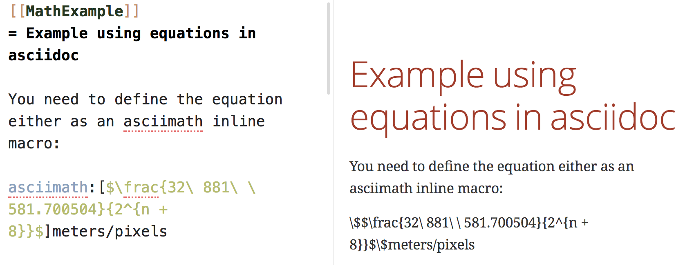
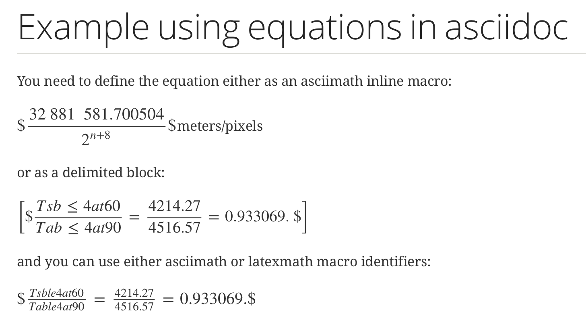
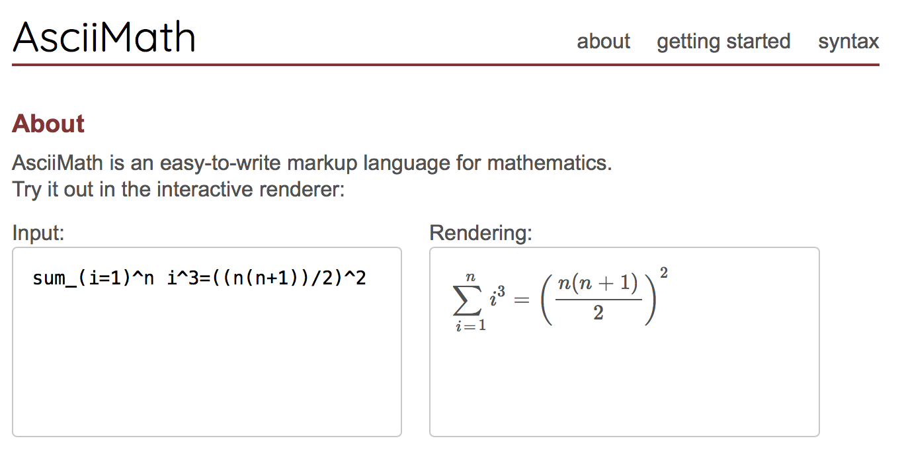

[[MathExample]]
== Example using equations in asciidoc

You need to define the equation either as an asciimath inline macro:

asciimath:[$\frac{32\ 881\ \ 581.700504}{2^{n + 8}}$]meters/pixels

as a delimited block:

[asciimath]
++++
[$\frac{Tsble4at60}{Table4at90} = \frac{4214.27}{4516.57} = 0.933069.$]
++++

or use the compact '\' notation

alternative

\[
   e^{2\pi \sqrt{-1}} = 1,
\]

For the macross, you can use either asciimath or latexmath macro identifiers:

latexmath:[$\frac{Tsble4at60}{Table4at90} = \frac{4214.27}{4516.57} = 0.933069.$]

Unfortunately, the preview in most tools will not display the equation correctly, see the screenshot from Atom as an example:

[#img_screenshotAtom,reftext='{figure-caption} {counter:figure-num}']
.Screenshot from Atom editor: the preview shows the raw formular

...but once compiled with the stem "latexmath" being set, it works well in the html (reason is that the code is actually interpreted by the Javascript engine of the browser).

[#img_screenshotAtom2,reftext='{figure-caption} {counter:figure-num}']
.Screenshot from Browser: the formular is correctly displayed

That means that the stem is not supported by the asciidoctor-pdf engine, i.e. you cannot produce pdf documents that way. We recommend that you rather use screenshots from the rendered html version for your pdf.

=== Compiling AsciiDoc with Equations
To compile this example, you would use

....
asciidoctor -a stem=latexmath 6-math_example.adoc
....

=== Generate Equations
If you need some help generating equations, http://asciimath.org[http://asciimath.org] offers a great equation building and compiling tool and provides further information.

[#img_screenshotAsciiMath,reftext='{figure-caption} {counter:figure-num}']
.Screenshot AsciiMath equation tool

