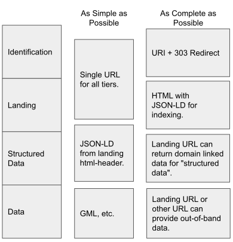

[[usecases]]
=== Domain Use Cases

The SELFIE relied on participant's domain-specific use cases to provide context and drive decision making in the context of the IE. The use cases included hydrogeology, soils, hydrology, and land-survey information. Common to these use cases was the need to work with identifiers for environmental features for which multiple representations are available. Each of the use cases was implemented to one extent or another. Full details of the use cases are included in <<DomainUseCases>>, domain use cases. Taken together and harmonized, these domain-specific use cases provided sufficient scope to determine a useful set of general use cases are summarized in the following sections.

=== General SELFIE Use Cases

General, as opposed to domain-specific, SELFIE use cases are described in the section that follows. To provide greater insight into their purpose, the organizational architecture and functionalities they entail are first described in some detail. The use cases aim to maintain technical rigor while being practical and approachable. This can be seen as a balance or tension, but rather, ease of implementation was used as a filter on technically rigorous solutions -- leaving complexity out where the team was not ready to recommend an easy-to-implement approach. While technical, and in some cases very specific, these use cases do not imply complete technical approaches. 

==== Organizational architectures

The SELFIE included applications with a variety of organizational architectures. This diversity resulted from the social, political, and technical setting the applications were situated in. Aspects that were potentially diverse included:

* Single to multiple non-information identifier (URI-14) registry and redirect systems.
* Single to multiple interlinked providers of landing content (URL-14).
* Single to multiple providers of feature representations and other data (URL-200).
This diversity required some careful consideration and handling and the solutions explored in SELFIE proved to hold up well across the range of organizational architectures encountered.

==== SELFIE Functionalities

The linked data architecture that resulted from SELFIE is based on the five functionalities that are described below. These are described as functional use cases that loosely align with the general use cases. These functions were common across practically all the examples considered by the experiment and are presented here as a general set of functions for linked environmental features and related data.

*Publication of identified non-information resources* is a prerequisite for establishing links between features and related data. Persistence and long-term uniqueness of URIs used to identify non-information resources is helpful but cannot be guaranteed. A robust system of linked data must be able to deal with changes to identifiers through re-indexing or similarity relationships. Similarly, use of common identifiers across organizations is helpful but cannot be guaranteed. Systems of linked data must be able to handle when organizations use different identifiers to refer to the same real-world feature.

A *network of linked features* is formed when considering topological and domain-specific linked data associations between identified features. From an indexing perspective, this network can be "crawled" and indexed by both domain-specific and general web search crawlers. While a rich graph of linked features can be resolved or may exist within a linked data system, the functionality required here is exposure of direct links from one feature to adjacent neighbors such that the linked-feature network can be traversed by a human user or Web crawler.

*Landing content* is common metadata about a feature and data associated with it. In addition to this common-core metadata, landing content might also include:

* A multi-organization index of information about the feature
* Links to multiple or alternative representations of the feature
* Pre-fetched information (e.g. labels and media-types) about resources.

*Structured-data to support search indexing* is the representation of landing content that is presented to a web-crawler. The lexicon of this most-default representation must be common to the Web (e.g. schema.org) and the breadth of content focused such that only specific pertinent details for general search, discovery, and general preview (such as a knowledge panel) are included. 

Providing links to *representations and related data* is the ultimate purpose of the system of linked data explored in SELFIE. Such resources are generally not natively defined in linked-data formats and can't be incorporated into the linked data graph directly. As described in detail later, such out-of-band resources must be referred to with associations like https://schema.org/url[schema.org/url] rather than as in-band linked data resources.

==== General Use Case Descriptions

The content model is best described with the use cases described in the following paragraphs.  

. real-world feature identification
. landing pages and other default content 
. structured data for search indexing
. links to representations and other data

The *feature identification* use case involves association of an HTTP URI with a recognized real world feature. In the most sophisticated implementations, this would be a "URI-14" URI which only ever returns a HTTP-303 see-other directing a client to a "URL-14" which would return landing content. However, a less sophisticated implementation may conflate the URI-14 and URL-14 resources such that the feature identification use case is satisfied with a URL that returns landing content. This was found to be valid and a practical approach. While practical, it must be noted that this should be an exception to the norm and that conflating identifiers for both a non-information resource and a information resource (URI-14 and URL-14), introduces ambiguity with wanting to refer to the actual real-world entity or the digital resource. 

The *landing content and network of linked features* use case focuses on the default content and encoding that a search-engine crawler expects. It involves the HTML media-type content returned by default when resolving a feature identification resource whether via 303-redirect or not. Structured data in landing content must be designed in the lexicon of the web, focused on schema.org and other common ontologies and encoded in JSON-LD. HTML content provides useful natural language descriptors and uses appropriate link relations wherever possible. The URL that is used to retrieve landing content could have a number of sophisticated alternative behaviors accessed via HTTP content negotiation and/or appended API patterns, but the default response when the accept header indicates HTML, would typically be designed to satisfy the needs of the landing content use case.

*Structured-data* for search indexing, what we might call in-band resources, could involve various lexicons and graph-views of linked data that adheres to the RDF data model and are part of a consistent structured data web architecture. Logically, such content should be returned from the URL used to retrieve landing content if the HTTP-accept header indicates a linked data type such as JSON-LD, html, and other hypermedia and media types included in a defined architecture. With regard to linked data types, use of API patterns such as those introduced in the Linked Data API or HTTP content negotiation by profile may be relevant here, a system may return all known associations to the identified feature, or a custom view of an extended linked data graph that meets the needs of an implementation. Given that multiple profiles of linked data may be available, the linked data rendered in the `<script>` header of the HTML representation of a landing resource may provide different content than other linked-data representations. This follows from the fact that many linked data use cases don't necessarily focus on search-engine indexing.

*Data* that represent or are otherwise related to features are what we refer to here as out-of-band. Such data are not part of the system of linked data and related content. These might be a complex GML representation of a feature, an image or map, a report, or a JSON representation of a timeseries. The distinction is that a given representation of a resource is either compatible with a technical architecture (i.e. can be parsed and handled by software that works with it) or is not (i.e. is opaque to software that works with the architecture). In-band content can directly extend the linked-data graph and out-of-band cannot. 

<<img_useCases>> provides a summary of the SELFIE functionalities in the context of the range of potential implementation sophistication.

[#img_useCases,reftext='{figure-caption} {counter:figure-num}']
.The four functions of the SELFIE general use cases. The most simple implementations, while limited, may use a single resource and content negotiation for all four functions. A complete SELFIE implementation would use separate resources for each function with linked-data hypermedia to facilitate discovery and access.

