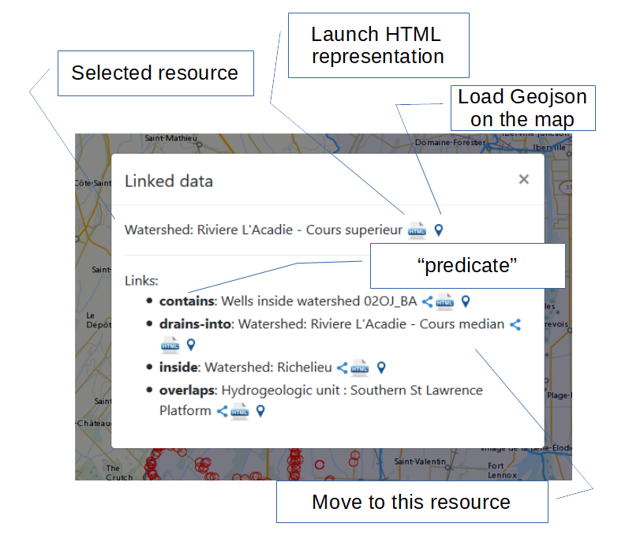
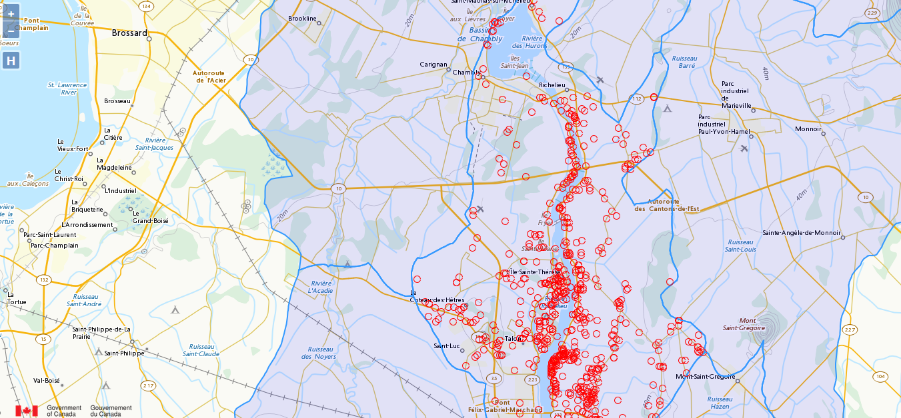
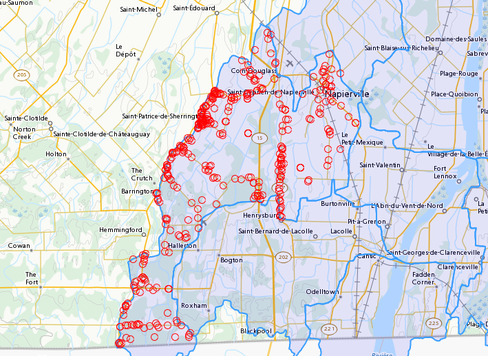

[appendix]
[[DomainUseCases]]
= Domain Use Cases

At the time of publication, these use cases were also available as web resources associated with the SELFIE project here: https://opengeospatial.github.io/ELFIE/[https://opengeospatial.github.io/ELFIE/]. The use cases documented in this report are only a sample of the use cases considered in SELFIE. 

=== US Internet of Water Distributed Data and Observations

==== Use Case Description

The Internet of Water (IoW) is an initiative https://www.aspeninstitute.org/tag/internet-of-water/[proposed by a multi-stakeholder workshop] that has been supported by a foundation and has a https://internetofwater.org/about/[non-profit organization] by the same name working toward the initiative's goals. The initiative proposes a federated system of data providers and consumers that are aggregated into domain-specific "hub" organizations and coordinated by a single "umbrella" organization. Data producers are to maintain ownership and control of their information and federation is intended to be cache-only in that information ownership should never be transferred if the data producer wants to maintain ownership. 

This use case applies to all types of water data--hydrography, hydrometric observations, hydrologic model results, water quality, hydrodynamics, etc. Ultimately, the hub and umbrella model requires construction of a linked-data system that references common environmental features throughout. Data providers' services should use consistent methods to reference those features to facilite automated discovery of newly available or changed data.

https://github.com/internetofwater/geoconnex.us[**See this github repository for more.**]
https://github.com/opengeospatial/SELFIE/tree/master/docs/usgs[**See the demo resources here for initial SELFIE content in this use case.**]
https://geoconnex.us/SELFIE/usgs/huc/huc12obs/070900020601[**Use this JSON-LD demo page as an entry-point.**]

===== User Story

As a user of water data, I need to discover and access water information relevant to the environmental feature I care about from all the organizations that hold data about it, so I don't have to have special knowledge to access some information and so I don't miss some potentially relevant information.

===== Datasets and Sources

* USGS Reference Hydrography
* State and local data and observations
* University consortia aggregated data services
* Federal aggregated data and services

In the long run, this demonstration should have a very broad scope. Initially, it will focus on building a catalog of hydrographic and observed data associated with hydrologic units. 

==== Demo Description and Links

For this demonstration, the primary entry point is a https://geoconnex.us/SELFIE/usgs/huc/huc12obs/070900020601[single hydrologic unit] with three realizations: 1) a https://geoconnex.us/SELFIE/usgs/nhdplusflowline/huc12obs/070900020601[hydrographic network] of flowlines, 2) a https://geoconnex.us/SELFIE/usgs/hucboundary/huc12obs/070900020601[catchment divide] containing a polygon representation, and 3) a https://geoconnex.us/SELFIE/usgs/hydrometricnetwork/huc12obs/070900020601[hydrometric network] index of monitoring data.

These three realizations can be seen in the example below:

----
{
 "@context": [
  "https://opengeospatial.github.io/ELFIE/contexts/elfie-2/elf-index.jsonld",
  "https://opengeospatial.github.io/ELFIE/contexts/elfie-2/hy_features.jsonld"
 ],
 "@id": "https://geoconnex.us/SELFIE/usgs/huc/huc12obs/070900020601",
 "@type": "https://www.opengis.net/def/appschema/hy_features/hyf/HY_Catchment",
 "name": "Waunakee Marsh-Sixmile Creek",
 "description": "USGS Watershed Boundary Dataset Twelve Digit Hydrologic Unit Code Watershed",
 "catchmentRealization": [
  {
   "@id": "https://geoconnex.us/SELFIE/usgs/nhdplusflowline/huc12obs/070900020601",
   "@type": "https://www.opengis.net/def/appschema/hy_features/hyf/HY_HydrographicNetwork"
  },
  {
   "@id": "https://geoconnex.us/SELFIE/usgs/hucboundary/huc12obs/070900020601",
   "@type": "https://www.opengis.net/def/appschema/hy_features/hyf/HY_CatchmentDivide"
  },
  {
   "@id": "https://geoconnex.us/SELFIE/usgs/hydrometricnetwork/huc12obs/070900020601",
   "@type": "https://www.opengis.net/def/appschema/hy_features/hyf/HY_HydrometricNetwork"
  }
 ]
}
----

===== Links to Demo Resources

The demo was created using the R code found here: https://github.com/opengeospatial/SELFIE/tree/master/tools/R  

While it will expand into other systems, the following resources have been contributed directly to the SELFIE space.

The top level Hydrologic Unit "HY\_Catchment":
https://geoconnex.us/SELFIE/usgs/huc/huc12obs/070900020601

The flowlines "HY\_HydrographicNetwork":
https://geoconnex.us/SELFIE/usgs/nhdplusflowline/huc12obs/070900020601

The boundary "HY\_CatchmentDivide":
https://geoconnex.us/SELFIE/usgs/hucboundary/huc12obs/070900020601

The monitoring sites "HY\_HydrometricNetwork":
https://geoconnex.us/SELFIE/usgs/hydrometricnetwork/huc12obs/070900020601

flowlines and boundary are intended to provide a visual representation and could also be used for geoprocessing workflows. Monitoring sites are a potentially long list of well-documented monitoring for the hydrologic unit. The state of "well-documented" in this use case is be a work in progress.

==== Demo findings and potential next steps

This demo demonstrates that the core SELFIE technical solution rooted in URI-14 -> URL-14 redirection works well. Links to representations and associated features are operable but additional implementations will be needed to gain needed experience before any strong conclusions can be made. Availability of domain feature models (classes and associations) continues to be an issue the community needs to address before full-fledged implementation of domain-data-model linked data will be possible.

=== Groundwater Surface Water Interoperability Pilot - SELFIE Demonstration

==== Use Case Description

Link various heterogeneous datasets from various sources under a common water ontology using linked data across Canada and USA.  The web application demonstrate how a linked data enabled application can use a predefined ontology to navigate across water related real world features potentially managed by various organizations within and across national jurisdictions.

===== User Story

I want to discover all the data related to water features (real world features relevant to surface water and groundwater) and how they are connected to other water features.  From a map, I want to select a feature and be able to traverse to another water feature by following a link.  I expect the application to understand key actionable properties of feature, such as the difference between a link to another water feature and a link to representations.  I also expect the application to recognize useful representations and perform specific operation on them (such as geojson).
Datasets and Sources

* Watersheds delimitation of the Richelieu-Lake Champlain (NRCan-CCMEO for canadian portion and USGS for american portion)
* Aquifer systems description (NRCan-GSC)
* Water wells NRCan-GSC (GIN) and SIH (Système d'information hydrogéologique) Ministère de l’Environnement et de la lutte aux changements climatique du Québec.
* Stream gauges (ECCC, Water office,  Meteorological Service of Canada and Centre d’expertise hydrique du Québec)
* Bedrock geology NRCan-GSC (based on various compilations) 
* Cross-border USGS hydrologic units 

===== Demo Description and Links

The demo is a web map application showing water related features. The map application operates on top of a linked data infrastructure (node) hosted on both side on the US-Canada border.  Each  GSIP node exposes a catalogue of water features from their respective jurisdiction, some cross-border (shared) features and establishes relations between water features on its side and features on the other side. 

The GSIP resolver is build on top of a RDF catalog, containing water features description and links to other features and representation.  GSIP deals with content negotiation and 303 redirect of NIR or other representation if necessary.  This figure show the overall interaction with GSIP node

[#img_gsipSequence,reftext='{figure-caption} {counter:figure-num}']
.GSIP sequence diagram
image::images/gsip_sequence.png[width=600,align="center"]

The linked data infrastructure operates on its own and can be access using a regular browser.  The map application leverages this infrastructure by adding new functionalities.

Features on the map are spatial representations of "real things" (Non-Information) in the world and assigned a URI as their identifier.   At this point, this is all the web application has (feature with their NIR). The map is pre-loaded with a set of watersheds around Lake Champlain. Canadian version of the application shows feature north of the border and vice-versa for US.  Note that NIR of water features can point anywhere (the canadian version can consume data from US node and vice and versa). When requested, the application attempts to resolve the feature’s NIR by issuing a HTTP GET request using the NIR URI and process the document and do something useful with it.  The application expects a RDF document conformant to the model (ontology) defined in this interoperability experiment. The application is robust as it will try to process whatever is returned by the resolution of the NIR.  If the RDF document does not contain any schema.org or RDFS or HY_Feature, etc.., it will simply do nothing.

The application then offers the option of 
* traverse a link to another water feature;
* open a representation in one of the proposed format;
* leave the map application and browse resources directly in the browser.

The application recognizes specifically Geojson representations and when available, the application can load it and add the content to the map.  If the uploaded feature has a `uri` property, the application assumes it’s a NIR and behave accordingly.

A typical session goes through a variation of these steps

. User loads the map application 
. User clicks on a feature
. Application displays information about the resources in an info bubble.
. User can
. click on a link (a predicate) and traverse to another resources
.. click on HTML icon and pop a new browser page/tab loaded with a landing page of the feature. At the point, the user “left” the application (although it remains available in the original tab if the user want to return).
.. Click on the GeoJSON “push” pin and load the feature on the map
. repeat from step #2

===== Harvesting 

While not explicitly demonstrated in the web application, the architecture relies on a series of nodes to resolve NIR. The current demonstration relies on 2 nodes (a.k.a geoconnex.ca and geoconnex.us) but it is totally agnostic of the number of nodes that can eventually be use while traversing from one water feature to another. Nodes are autonomous and are not “aware” that a statement refers to a resource managed by another “GSIP” node (they are just NIR that will be resolved by the client).  But the a node might be interested in those statements, specially when it can create a reciprocate statement (if A in US is upstream of B in Canada, B  is downstream of A).  When such a statement is added to either node, the node of interest needs to be updated to reflect that change.  The GSIP architecture includes a harvester that probe known nodes (the Canadian harvester knows the location of the US node) and extract relevant cross border (cross node) statements and update its copy of the catalog.  The harvesting is done periodically.

==== Links to Demo Resources

The demo instances are located at https://geoconnex.ca/gsip/app/index.html and https://cida-test.er.usgs.gov/chyld-pilot/app/index.html .  The web application is a map where water related features are shown.  The map has watershed delimitation permanently displayed.  Other features are displayed if a geojson representation is available and the user requests it.  

[#img_gsipMap,reftext='{figure-caption} {counter:figure-num}']
.GSIP web application
image::images/gsip_map.png[width=600,align="center"]

Clicking on a feature displays an information bubble containing names and linkages to other resources (a.k.a, in band).  The information bubble is built from the MIR received from GSIP.  Each resource has a link to its landing page (HTML icon).  Clicking on the link loads the page in a different tab, outside the web application.  Interacting with the landing page is done outside the context of the map application and behave similarly to other demos in this report.

[#img_gsipInfo,reftext='{figure-caption} {counter:figure-num}']
.GSIP information bubble

Resources having a geojson representation show a “pushpin” icon. Clicking the pushpin loads the geojson representation of that resource into the map in red [figure 3].  The loaded feature can also be clicked and if it has a “uri” property, the application will try to dereference it.  If it succeeds, an information bubble is displayed. 

[#img_gsipGeoJSON,reftext='{figure-caption} {counter:figure-num}']
.GeoJSON loaded on the map

A typical NIR URI : https://geoconnex.ca/gsip/id/catchment/02OJ*BA will be redirected to MIR https://geoconnex.ca/gsip/info/catchment/02OJ*BA containing, among other things, the information used to populate the information bubble.

The key elements of interest that is reflected in the information bubble are presented here in RDF TTL (a full MIR is available in annex.  Note that statements were manually reorganised here to illustrate the key statements)

----
@prefix schema: <http://schema.org/> .
@prefix dct:   <http://purl.org/dc/terms/> .
@prefix rdfs:  <http://www.w3.org/2000/01/rdf-schema#> .
@prefix hy: <http://geosciences.ca/def/hydraulic#>.

# "in band" data – actionable information
<https://geoconnex.ca/id/catchment/02OJ*BA>
        a hy:HY_Catchment> , <http://www.w3.org/2002/07/owl#Thing> , rdfs:Resource ;
        rdfs:label        "Watershed: Riviere L'Acadie - Cours superieur"@en , "Bassin versant : Riviere L'Acadie - Cours superieur"@fr ;
        hy:contains
                <https://geoconnex.ca/id/featureCollection/wellsIn02OJ_BA> ;
        hy:drains-into
                <https://geoconnex.ca/id/catchment/02OJ*BB> ;
        hy:inside
                <https://geoconnex.ca/id/catchment/02OJ> ;
        hy:overlaps
                <https://geoconnex.ca/id/hydrogeounits/Richelieu1> ;
        schema:name       "Watershed : Riviere L'Acadie - Cours superieur" , "02OJ*BA".

# links to other representations (one 1 here), either out of band or in band, depending of dct:conformsTo value.  The following example does not announce any conformance and therefore is “out-of-band” by default.

<https://geoconnex.ca/id/catchment/02OJ*BA> schema:subjectOf  <https://geoconnex.ca/data/catchment/HYF/WSCSSSDA/NRCAN/02OJ*BA>.

# description of that representation.  
<https://geoconnex.ca/data/catchment/HYF/WSCSSSDA/NRCAN/02OJ*BA>
        dct:format       "application/vnd.geo+json" , "text/html" ;
        schema:provider  <http://gin.gw-info.net> .
----

For example, a US watershed might state that it is upstream of a canadian watershed.  

eg:

----
<https://geoconnex.us/chyld-pilot/id/hu/041504081604>
        <https://www.opengis.net/def/hy_features/ontology/hyf/lowerCatchment>
                <https://geoconnex.ca/id/catchment/02OJ*CA> .
----

[#img_gsipCAN_US,reftext='{figure-caption} {counter:figure-num}']
.Canadian watershed pulled from canadian node shown on US instance
image::images/gsip_aq_can_on_us.png[width=600,align="center"]

==== Demo findings and potential next steps

This demo explores the possibility of developing software on top of linked data infrastructure. It is slightly different from the common web heavy demonstration of search engines + web browser + html.  The web application perform operations that are not usually done by browsers alone (such as manipulation spatial data and display them). Another demo implementation has been created in a non-browser environment (QGIS), with the same capabilities

[#img_QGIS,reftext='{figure-caption} {counter:figure-num}']
.Same demo implemented in QGIS

Because the application has prior knowledge of the model, or more accurately put, is able to recognize some specialized content, it can act upon it. We could envision more specific application, such as a tool that is HY_Feature aware rebuilding complete watershed from one point by traversing “upperCatchment” predicate or a GWML aware application locating recharge area from of an aquifer, or a GeoSciML aware application all dataset relevant to a stratigraphic columns (as an ‘aspatial’ exemple).  Because the landing page can mix predicates and classes from many ontology, many application can be built on over the same linked data infrastructure. 

==== Annex
----
@prefix schema: <http://schema.org/> .
@prefix dct:   <http://purl.org/dc/terms/> .
@prefix rdfs:  <http://www.w3.org/2000/01/rdf-schema#> .

<https://geoconnex.ca/data/catchment/HYF/WSCSSSDA/NRCAN/02OJ*BA>
        dct:conformsTo   <https://www.opengis.net/def/gwml2> ;
        dct:format       "application/vnd.geo+json" , "text/html" ;
        schema:provider  <http://gin.gw-info.net> .

rdfs:Resource  a         rdfs:Class , <http://www.w3.org/2002/07/owl#Class> , rdfs:Resource ;
        rdfs:subClassOf  rdfs:Resource ;
        <http://www.w3.org/2002/07/owl#equivalentClass>
                rdfs:Resource .

<https://geoconnex.ca/id/hydrogeounits/Richelieu1>
        a                   <http://geosciences.ca/def/groundwater#GW_HydrogeoUnit> , <http://www.w3.org/2002/07/owl#Thing> , rdfs:Resource ;
        rdfs:label          "Unite hydrogeologique : Plate-forme du St-Laurent sud"@fr , "Hydrogeologic unit : Southern St Lawrence Platform"@en ;
        <http://geosciences.ca/def/groundwater#gwAquiferSystem>
                <https://geoconnex.ca/id/aquiferSystems/Richelieu> ;
        hy:contains>
                <https://geoconnex.ca/id/swmonitoring/WSC_02OJ026> , <https://geoconnex.ca/id/gwmonitoring/prj_27.53537> , <https://geoconnex.ca/id/gwmonitoring/prj_27.53515> , <https://geoconnex.ca/id/swmonitoring/MDDELCC_030430> , <https://geoconnex.ca/id/swmonitoring/MDDELCC_030421> , <https://geoconnex.ca/id/swmonitoring/WSC_02OJ024> , <https://geoconnex.ca/id/swmonitoring/WSC_02OJ007> , <https://geoconnex.ca/id/gwmonitoring/prj_27.53529> , <https://geoconnex.ca/id/swmonitoring/WSC_02OJ016> , <https://geoconnex.ca/id/gwmonitoring/prj_27.53545> , <https://geoconnex.ca/id/swmonitoring/MDDELCC_030415> , <https://geoconnex.ca/id/gwmonitoring/prj_27.53517> , <https://geoconnex.ca/id/gwmonitoring/prj_27.53544> ;
        hy:measuredBy>
                <https://geoconnex.ca/id/gwmonitoring/prj_27.53515> , <https://geoconnex.ca/id/gwmonitoring/prj_27.53537> , <https://geoconnex.ca/id/gwmonitoring/prj_27.53517> , <https://geoconnex.ca/id/gwmonitoring/prj_27.53544> , <https://geoconnex.ca/id/gwmonitoring/prj_27.53545> , <https://geoconnex.ca/id/gwmonitoring/prj_27.53529> ;
        hy:overlaps>
                <https://geoconnex.ca/id/catchment/02OJ*AB> , <https://geoconnex.ca/id/geologicUnits/008000/GSCC00053008397> , <https://geoconnex.ca/id/catchment/02OJ*DB> , <https://geoconnex.ca/id/catchment/02OJ*DA> , <https://geoconnex.ca/id/geologicUnits/006000/GSCC00053006880> , <https://geoconnex.ca/id/geologicUnits/014000/GSCC00053014607> , <https://geoconnex.ca/id/catchment/02OJ*CA> , <https://geoconnex.ca/id/geologicUnits/011000/GSCC00053011490> , <https://geoconnex.ca/id/catchment/02OJ*CC> , <https://geoconnex.ca/id/catchment/02OJ*DC> , <https://geoconnex.ca/id/geologicUnits/010000/GSCC00053010067> , <https://geoconnex.ca/id/geologicUnits/010000/GSCC00053010658> , <https://geoconnex.ca/id/catchment/02OJ*CB> , <https://geoconnex.ca/id/geologicUnits/003000/GSCC00053015117> , <https://geoconnex.ca/id/catchment/02OJ*BB> , <https://geoconnex.ca/id/catchment/02OJ*BA> , <https://geoconnex.ca/id/geologicUnits/017000/GSCC00053017020> , <https://geoconnex.ca/id/catchment/02OJ*CE> , <https://geoconnex.ca/id/catchment/02OJ*CD> , <https://geoconnex.ca/id/geologicUnits/010000/GSCC00053010757> , <https://geoconnex.ca/id/catchment/02OJ*AA> , <https://geoconnex.ca/id/geologicUnits/008000/GSCC00053008293> , <https://geoconnex.ca/id/geologicUnits/015000/GSCC00053015716> , <https://geoconnex.ca/id/geologicUnits/008000/GSCC00053008833> , <https://geoconnex.ca/id/geologicUnits/001000/GSCC00053001039> , <https://geoconnex.ca/id/geologicUnits/012000/GSCC00053012027> , <https://geoconnex.ca/id/geologicUnits/000000/GSCC00053000990> , <https://geoconnex.ca/id/catchment/02OJ*BC> , <https://geoconnex.ca/id/catchment/02OJ*CF> ;
        schema:description  "\r\nIn the context of the southern area of the St. Lawrence Platform of (south Lowlands), the clay unit is generally not continuous or thick. The bedrock is rather covered by a till unit of at least 10 m thick which may allow significant bedrock aquifer recharge rates. This limited sedimentary cover suggests that there would be links between the bedrock aquifer and streams, particularly along some sections of the Richelieu River, which constitute discharge areas. The flow is oriented east-west, from the recharge areas to Richelieu River or others discharge areas. The surficial permeable sediments with significant thickness have small spatial extension, thus that the aquifer potential is mainly based on fractured bedrock aquifer. In the unit, there is a significant use of groundwater as water supply. The predominant semi-confined conditions involve a moderate vulnerability of the bedrock aquifer. Groundwater exceeds frequently some aesthetic criteria as Fe, Mn, S, Na, and F in the central area of the hydrogeological unit.\r\n" ;
        schema:image        "http://gin.gw-info.net/service/ngwds//en/wms/ngwd-wms/inset?REQUEST=GetMap&SERVICE=WMS&VERSION=1.1.1&LAYERS=area&STYLES=&FORMAT=image/png&BGCOLOR=0xFFFFFF&TRANSPARENT=TRUE&SRS=EPSG:4326&BBOX=-73.6883387829505,44.9741147159004,-72.8050177950318,45.6366054568393&WIDTH=400&HEIGHT=300&TABLE=gw_data.hydrogeological_units&FIELD=id&ID=1" ;
        schema:name         "Hydrogeologic unit : Southern St Lawrence Platform" ;
        <http://www.opengeospatial.org/standards/geosparql/sfIntersects>
                <https://cida-test.er.usgs.gov/chyld-pilot/id/hu/041504081507-drainage_basin> , <https://cida-test.er.usgs.gov/chyld-pilot/id/hu/041504081102-drainage_basin> , <https://cida-test.er.usgs.gov/chyld-pilot/id/hu/041504081007-drainage_basin> , <https://cida-test.er.usgs.gov/chyld-pilot/id/hu/041504081006-drainage_basin> , <https://cida-test.er.usgs.gov/chyld-pilot/id/hu/041504081005> , <https://cida-test.er.usgs.gov/chyld-pilot/id/hu/041504081507> , <https://cida-test.er.usgs.gov/chyld-pilot/id/hu/041504081505-drainage_basin> , <https://cida-test.er.usgs.gov/chyld-pilot/id/hu/041504081203> , <https://cida-test.er.usgs.gov/chyld-pilot/id/hu/041504081006> , <https://cida-test.er.usgs.gov/chyld-pilot/id/hu/041504081007> , <https://cida-test.er.usgs.gov/chyld-pilot/id/hu/041504081005-drainage_basin> , <https://cida-test.er.usgs.gov/chyld-pilot/id/hu/041504081505> , <https://cida-test.er.usgs.gov/chyld-pilot/id/hu/041504081203-drainage_basin> ;
        <http://www.w3.org/2002/07/owl#sameAs>
                <https://geoconnex.ca/id/hydrogeounits/Richelieu1> .

<https://geoconnex.ca/id/catchment/02OJ>
        a            <http://www.w3.org/2002/07/owl#Thing> , hy:HY_Catchment> , rdfs:Resource ;
        rdfs:label   "Watershed: Richelieu"@en , "Bassin versant: Richelieu"@fr ;
        hy:contains>
                <https://geoconnex.ca/id/gwmonitoring/prj_27.53523> , <https://geoconnex.ca/id/catchment/02OJ*DD> , <https://geoconnex.ca/id/featureCollection/wellsIn02OJ_DC> , <https://geoconnex.ca/id/featureCollection/wellsIn02OJ_CC> , <https://geoconnex.ca/id/featureCollection/wellsIn02OJ_CE> , <https://geoconnex.ca/id/gwmonitoring/prj_27.53541> , <https://geoconnex.ca/id/swmonitoring/WSC_02OJ026> , <https://geoconnex.ca/id/featureCollection/wellsIn02OJ_DH> , <https://geoconnex.ca/id/gwmonitoring/prj_27.53517> , <https://geoconnex.ca/id/catchment/02OJ*DH> , <https://geoconnex.ca/id/gwmonitoring/prj_27.53544> , <https://geoconnex.ca/id/catchment/02OJ*CC> , <https://geoconnex.ca/id/catchment/02OJ*BC> , <https://geoconnex.ca/id/featureCollection/wellsIn02OJ_BB> , <https://geoconnex.ca/id/featureCollection/wellsIn02OJ_AB> , <https://geoconnex.ca/id/swmonitoring/MDDELCC_030421> , <https://geoconnex.ca/id/gwmonitoring/prj_27.53510> , <https://geoconnex.ca/id/catchment/02OJ*DA> , <https://geoconnex.ca/id/catchment/02OJ*DC> , <https://geoconnex.ca/id/swmonitoring/WSC_02OJ007> , <https://geoconnex.ca/id/featureCollection/wellsIn02OJ_DA> , <https://geoconnex.ca/id/featureCollection/wellsIn02OJ_DB> , <https://geoconnex.ca/id/featureCollection/wellsIn02OJ_CB> , <https://geoconnex.ca/id/catchment/02OJ*AB> , <https://geoconnex.ca/id/gwmonitoring/prj_27.53515> , <https://geoconnex.ca/id/featureCollection/wellsIn02OJ_DE> , <https://geoconnex.ca/id/featureCollection/wellsIn02OJ_DG> , <https://geoconnex.ca/id/catchment/02OJ*DG> , <https://geoconnex.ca/id/catchment/02OJ*CB> , <https://geoconnex.ca/id/catchment/02OJ*BB> , <https://geoconnex.ca/id/gwmonitoring/prj_27.53545> , <https://geoconnex.ca/id/featureCollection/wellsIn02OJ_BA> , <https://geoconnex.ca/id/featureCollection/wellsIn02OJ_AA> , <https://geoconnex.ca/id/gwmonitoring/prj_27.53529> , <https://geoconnex.ca/id/swmonitoring/MDDELCC_030430> , <https://geoconnex.ca/id/catchment/02OJ*DB> , <https://geoconnex.ca/id/swmonitoring/WSC_02OJ016> , <https://geoconnex.ca/id/catchment/02OJ*CF> , <https://geoconnex.ca/id/featureCollection/wellsIn02OJ_CA> , <https://geoconnex.ca/id/catchment/02OJ*AA> , <https://geoconnex.ca/id/catchment/02OJ*DE> , <https://geoconnex.ca/id/swmonitoring/WSC_02OJ024> , <https://geoconnex.ca/id/gwmonitoring/prj_27.53632> , <https://geoconnex.ca/id/featureCollection/wellsIn02OJ_DD> , <https://geoconnex.ca/id/featureCollection/wellsIn02OJ_CD> , <https://geoconnex.ca/id/featureCollection/wellsIn02OJ_DF> , <https://geoconnex.ca/id/featureCollection/wellsIn02OJ_CF> , <https://geoconnex.ca/id/catchment/02OJ*DF> , <https://geoconnex.ca/id/catchment/02OJ*CA> , <https://geoconnex.ca/id/gwmonitoring/prj_27.53542> , <https://geoconnex.ca/id/catchment/02OJ*BA> , <https://geoconnex.ca/id/swmonitoring/MDDELCC_030429> , <https://geoconnex.ca/id/gwmonitoring/prj_27.53518> , <https://geoconnex.ca/id/catchment/02OJ*CD> , <https://geoconnex.ca/id/gwmonitoring/prj_27.53537> , <https://geoconnex.ca/id/featureCollection/wellsIn02OJ_BC> , <https://geoconnex.ca/id/swmonitoring/MDDELCC_030415> , <https://geoconnex.ca/id/catchment/02OJ*CE> ;
        schema:name  "Watershed : Richelieu" ;
        <http://www.w3.org/2002/07/owl#sameAs>
                <https://geoconnex.ca/id/catchment/02OJ> .

<https://geoconnex.ca/id/catchment/02OJ*BA>
        a                 hy:HY_Catchment> , <http://www.w3.org/2002/07/owl#Thing> , rdfs:Resource ;
        rdfs:label        "Watershed: Riviere L'Acadie - Cours superieur"@en , "Bassin versant : Riviere L'Acadie - Cours superieur"@fr ;
        hy:contains>
                <https://geoconnex.ca/id/featureCollection/wellsIn02OJ_BA> ;
        hy:drains-into>
                <https://geoconnex.ca/id/catchment/02OJ*BB> ;
        hy:inside>
                <https://geoconnex.ca/id/catchment/02OJ> ;
        hy:overlaps>
                <https://geoconnex.ca/id/hydrogeounits/Richelieu1> ;
        schema:name       "Watershed : Riviere L'Acadie - Cours superieur" , "02OJ*BA" ;
        schema:subjectOf  <https://geoconnex.ca/data/catchment/HYF/WSCSSSDA/NRCAN/02OJ*BA> ;
        <http://www.w3.org/2002/07/owl#sameAs>
                <https://geoconnex.ca/id/catchment/02OJ*BA> .

<https://geoconnex.ca/id/featureCollection/wellsIn02OJ_BA>
        a           <http://www.w3.org/2002/07/owl#Thing> , rdfs:Resource ;
        rdfs:label  "Wells inside watershed 02OJ_BA"@en , "Puits a l'interieur du bassin 02OJ_BA"@fr ;
        hy:inside>
                <https://geoconnex.ca/id/catchment/02OJ> , <https://geoconnex.ca/id/catchment/02OJ*BA> ;
        <http://www.w3.org/2002/07/owl#sameAs>
                <https://geoconnex.ca/id/featureCollection/wellsIn02OJ_BA> .

hy:HY_Catchment>
        a                rdfs:Class , <http://www.w3.org/2002/07/owl#Class> , rdfs:Resource ;
        rdfs:label       "Bassin de drainage"@fr , "Catchment"@en ;
        rdfs:subClassOf  hy:HY_Catchment> , <http://www.w3.org/2002/07/owl#Thing> , rdfs:Resource ;
        <http://www.w3.org/2002/07/owl#equivalentClass>
                hy:HY_Catchment> .

<https://geoconnex.ca/id/catchment/02OJ*BB>
        a            <http://www.w3.org/2002/07/owl#Thing> , rdfs:Resource , hy:HY_Catchment> ;
        rdfs:label   "Bassin versant: Riviere L'Acadie - Cours median"@fr , "Watershed: Riviere L'Acadie - Cours median"@en ;
        hy:contains>
                <https://geoconnex.ca/id/gwmonitoring/prj_27.53537> , <https://geoconnex.ca/id/featureCollection/wellsIn02OJ_BB> ;
        hy:drains>
                <https://geoconnex.ca/id/catchment/02OJ*BA> ;
        hy:drains-into>
                <https://geoconnex.ca/id/catchment/02OJ*BC> ;
        hy:inside>
                <https://geoconnex.ca/id/catchment/02OJ> ;
        hy:overlaps>
                <https://geoconnex.ca/id/hydrogeounits/Richelieu1> ;
        schema:name  "Watershed : Riviere L'Acadie - Cours median" ;
        <http://www.w3.org/2002/07/owl#sameAs>
                <https://geoconnex.ca/id/catchment/02OJ*BB> .

<http://www.w3.org/2002/07/owl#Thing>
        a                rdfs:Class , <http://www.w3.org/2002/07/owl#Class> , rdfs:Resource ;
        rdfs:subClassOf  <http://www.w3.org/2002/07/owl#Thing> , rdfs:Resource ;
        <http://www.w3.org/2002/07/owl#equivalentClass>
                <http://www.w3.org/2002/07/owl#Thing> .
----

=== BRGM - INSIDE research center - Surface / Ground water linked data gazetteer 

==== Use Case Description 

This use case builds on the one set up for the OGC ELFIE and tries to test a system coping with two specific requirements: 

[upperalpha]
. clients that dereference a URI asking for a specific media-type, content model etc...
. clients that dereference the same URI without knowing beforehand the available media-type, content model etc. in a kind of "probing" or "discovery" behaviour 

===== User Story

Clients from group A can be very diverse 

* linked data centered application : in this case BLiV (BRGM Linked data Viewer) is considered. BLiV  (https://data.geoscience.fr/Bliv/) is developped to ingest 
** natively, linked data serialization
** if not available, ask the end-user (human being), if he wants to interact with the other representations/serialisations available
* desktop GIS : QGIS with GML Application Schema Toolbox which expects responses that are GML application schema compliant (e.g. https://plugins.qgis.org/plugins/gml_application_schema_toolbox/)
* search engines crawlers  : which expect HTML with JSON-LD in the `<script>` header 

Clients from group B don't correspond to the vast majority of the clients considered in Linked Data oriented approaches because, most of the time, specific implementation environments are considered (e.g. linking Non Information Resources together and somehow expecting a specific serialization content-model paradigm, web interfaces, reasoning).
 
However, this need should not be overlooked as in running production environments, especially when linking information about Non Information Resources together with another system, (linked) data manager and their associated system(s) need to know what's is available 'behind' a URI. At least to cross-check they are linking to the relevant resource. Just knowing the URI-14 is not always sufficient for disambiguation.

The client dereferences a URI without specifying any media-type, content model, etc. and retrieves what combination of information is available.

From this

* Client from group B: checks that they are linking to the relevant resource.
* Client from group A: assesses whether they can consider the data content available provided in-band or out-of-band and interact with what suits them the most (or not).

Clients from group A follow a 1 step approach from URI-14 to the data content skipping the URL-14 landing content whereas clients from group B may apply the complete URI-14 -> URL-14 -> data content pattern.

===== Datasets & APIs

* BRGM BD LISA : French Aquifer dataset provided using international semantic and technical interoperability approaches. BRGM already provides an OGC API Feature implementation on top of BD LISA that exposes the content according to OGC:GWML2 in GML, GeoJSON, JSON-LD with a URI resolver on top.

* SANDRE Aquifer reference dataset : The French Aquifer dataset is provided according to French Water Information System conceptual model (semantics), and interchange format(XML serialization) etc... Note : in both cases the source dataset (instances) is the same.

==== Demo Description and Links

The use case corresponds somehow to set up what could be called a linked-data-gazetteer along with the corresponding URI configuration

In order to fulfill it, the following steps have been carried out

* define a model that allows to know in which media-type, content model etc. a given instance is available. This mode is a level of abstraction higher than SELFIE content model (https://data.geoscience.fr/def/LinkedDataGazetteer.xsd)
* populate it for the French Aquifer dataset
* implement that model on an OGC API Features using Geoserver
* fund and drive the necessary evolutions so that Geoserver OGC API - Features implementation is capable of serving JSON-LD content and ultimately deploy within BRGM infrastructure.

The API endpoint is the following: https://data.geoscience.fr/api/LDGazetteerFAPI and allows to search within the French Aquifer dataset

===== Demo Screenshot(s)

Group B use case leads to dereferencing the same URI asking for nothing (ex: using cURL) and loading URI-14 landing content into BLIV

Then traversing "in-band" to fetch the Aquifer description in BLIV (ex : JSON-LD) or move to other content model, media-types. (GWML2 in GML, SANDRE in XML) and use it in another application.

[#121AS01_inBLiV,reftext='{figure-caption} {counter:figure-num}']
.French Hydrogeologic unit 121AS01 landing data in BLiV
image::images/121AS01_inBLiV.png[width=600,align="center"]

Group A use case leads to dereferencing the same URI asking for

* `application/ld+json`: that Aquifer in BLiV in JSON-LD (see ELFIE demos on https://opengeospatial.github.io/ELFIE/)
* `application/gml+xml`: that Aquifer in QGIS with GML Application Schema Toolbox (see demos under https://github.com/BRGM/gml_application_schema_toolbox/tree/master/presentations)
* `text/html` (or variations around this): resolver logs clearly show that Google Bots (or Bing or other crawlers) ask for text/html (or variations around this) ask for and receive the corresponding content. The plan is then to refine the embeded JSON-LD content in the `<script>` header of this representation.

==== Demo findings and potential next steps
The implementation of the linked-data-gazetteer serving SELFIE content model compliant payload clearly demonstrates 

* that SELFIE proposed content model fills a gap in linked data systems enabling description of various representations available for a given URI-14
* the importance of the in-band / out-of-band distinction to better understand what client actually expects. The introduction of that terminology within SELFIE members discussions clearly helped move forward towards a common understanding
* the evolution of how content negotiation is being considered (ex: adding notion of profiles), will change how linked data systems are designed and implemented (on both client & server side). When this evolution becomes mainstream in the implementations, it will become more natural for (linked) data managers to link resource together using a URI-14.

Several potential next steps have been identified

* Hypermedia-driven resource resolution versus content negotiation-driven resource resolution needs to be further discussed as both approaches have their pros & cons. An issue is created to compare SELFIE content model with W3C DXWG ConnegP. A quick cross-check seems to identify the following elements (but more in depth work is required)
** connegP 'type' seems to map to SELFIE choice of 'format'
** connegP 'profile' seems to map to SELFIE choice of 'conformsTo'
** but there is no notion of "primaryTopic" and no "provider" in connegP
* the 'dc:partOf' in SELFIE content model could also be a specific view/profile (a data content) and not embedded in the URL-14 landing content. It seems to us that we are mixing two different use cases : "URI-14 to data content probing and discovery" VS "exploring a domain graph of linked feature". We may consider serving this domain graph in a data content later on.
* what response should be provided to a client trying to dereference a URI-14 and asking for specific media-type, content model etc. that cannot be provided? It would make sense to respond back with what is actually known to be available using SELFIE content model but have not been implemented in our system.
* in its current version (1.2.0), QGIS GML Application Schema Toolbox plugin "identifies" itself when dereferencing a URI (default behaviour is to have the HTTP Use-Agent named "QGIS GML Application Schema Toolbox"). This allows to know at the resolver level that the expected media-type to be used is `application/gml+xml`. This mechanism, should be revised and it is already planned to have this QGIS plugin evolve to a better implementation of content negotiation, explicitly stating what the client wants to retrieve

=== CeRDI VVG - SELFIE Demonstration

==== Use Case Description

To provide a means whereby all the relevant information (resources) about a real world feature (in this case a borehole or well) 
can be brought together via machine readable (and indexable) web available information.

https://geo.org.au/info/well/46217[**CeRDI SELFIE testbed**]

===== User Story

Groundwater borehole data management in Victoria is split across a number of Government departments, research agencies and community groups. 
Information about the same real-world entity borehole may exist in multiple databases.  The VVG web portal partly 
addressed this problem by federating these disparate data services into a spatial web portal 
that allows the user to access ALL the information regardless of the source or duplication. https://www.vvg.org.au/cb_pages/history_of_bore_data.php[**History of Bore data in Victoria**]  

Information about a borehole exists at one or more of:

* Geological Survey of Victoria (GSV)
* Department of Environment, Land, Water and Planning (DELWP)
* State Library of Victoria (SLV)
* Federation Univesity Australia (FedUni)

These are services deliver one or more of:

* HTML
* GML
* JSON
* Documents / multimedia

The data from these services may be about:

* Geology / Aquifers
* Groundwater (water quality, levels)
* Borehole construction
* Reports
* Observations made on things intersected in the bore

Currently a person or automated client must individually discover and access these different data services 
and compile the relevant information about a Borehole manually. Where the same borehole 
exists across multiple data sources it is not readily apparent that they are the same real world feature (there is no common identifier across these services). Additionally, 
there is no mechanism to identify the different types of information available.

Through this demonstration, a user should be able to use a standard search engine to discover the availability of these various sources, formats and contents via URL-14 landing content.
The user (including machines) can navigate via the links in the landing content to request data from the various providers in one of the available formats.

===== Datasets

* Geological Survey of Victoria (GSV) - https://www.vvg.org.au/cb_pages/gedis.php[**Geological Exploration and Development Information System (GEDIS)**]
* Department of Environment, Land, Water and Planning (DELWP) - https://www.vvg.org.au/cb_pages/wmis.php[**Water Measurement Information System (WMIS)**]
* Federation University Australia - https://www.vvg.org.au/cb_pages/ub_spatial_bore_database.php[**Groundwater research bores**]
* State Library of Victoria (SLV) - https://www.vvg.org.au/cb_pages/digitisation_of_historical_records.php[**Boring Records**]
* Environmental Protection Authority Victoria (EPA) - TBC

==== Demo Description and Links

What have we done: The demo is currently designed to expose a single borehole via its real-world identifier. 
. The application resolves a URI-14 URI pattern for the real-world-feature of the form https://geo.org.au/id/well/46217 which performs a 303 redirect to URL-14 landing content at: https://geo.org.au/info/46217
. The application then uses a lookup tool (rosetta stone) to determine which of the various data providers 
have a corresponding borehole and the source-specific ID needed to access URL-200 data resource for that borehole. 
. Basic Content Negotiation via accepts header caters for both HTML (with embedded JSON-LD) and straight JSON-LD.
The format can be overriden with either a .json or ?f=json in the URI   
For the JSON-LD the landing-content encodes links to various representations as URL-200s in a SubjectOf block of associations. 

===== Demo Screenshot(s)

[#img_CERDI,reftext='{figure-caption} {counter:figure-num}']
.CeRDI Landing Content Screenshot
image::images/SELFIE_MR_Well_html.png[width=600,align="center"]

===== Links to Demo Resources

[#table_feduni,reftext='{table-caption} {counter:table-num}']
.FedUni Meta Resource landing-content Examples
[cols="50e,50e",width="90%",options="header",align="center"]
|===
|Demo | Link
|JSON LD Example |https://geo.org.au/info/well/46217?f=json[**https://geo.org.au/info/well/46217?f=json**]
|Photos/Reports |https://geo.org.au/info/well/WA1[**https://geo.org.au/info/well/WA1**]
|State library Archives |https://geo.org.au/info/well/326217[**https://geo.org.au/info/well/326217**]
|===

For the URL-200 data resources, in most cases, we were starting with existing WFS services delivering complex features as GML. 
We have made use of Alistair Ritchie's WFS mediator to allow on-the-fly conversion of the GML into JSON-LD and HTML (as implemented in ELFIE)
We have not been able to validate these yet apart from checking that they generate something that looks like JSON-LD. 

These data resources follow a URI scheme `/sourceprovider/data/datatype/featuretype/id`

[#table_feduni2,reftext='{table-caption} {counter:table-num}']
.FedUni Data Resource Examples
[cols="50e,50e",width="90%",options="header",align="center"]
|===
|Demo | Link
|WMIS Service |https://id.cerdi.edu.au/wmis/data/gwml2/well/46217?f=json[**https://id.cerdi.edu.au/wmis/data/gwml2/well/46217?f=json**]  
|GSV service |https://id.cerdi.edu.au/gsv/data/gsml2/borehole/46217?f=json[**https://id.cerdi.edu.au/gsv/data/gsml2/borehole/46217?f=json**] 
|Lab data (water quality) ObservationCollection via bore ID|https://id.cerdi.edu.au/wmis/data/sosa/observationcollection/46217?f=json[**https://id.cerdi.edu.au/wmis/data/sosa/observationcollection/46217?f=json**]
|===

==== Demo findings and potential next steps
The Federation University Use Case was that information about a single real world feature (a Non-Information Resource, which in this case was a ‘Borehole’) was available online, in multiple formats and representations; and from multiple authoritative sources. SELFIE sought a mechanism whereby these various resources could be related to each other in a way that was discoverable and machine navigable e.g. search engines. The proposed SELFIE solution was JSON-LD landing-content that linked these various online resources together.
SELFIE achieved all Federation University’s Use Case requirements, except in one crucial area. There was no satisfactory solution to encoding landing content for different data content. For example, different resources about a single borehole may contain data that is structured according to various domain models, i.e. different ‘profiles’, such as GeoSciML:Borehole, GroundWaterML2:Borehole or GroundWaterML2: GW_Well.
Four options were considered as part of the experiment:

.	Use schema.org:sameAs
* The understanding of the IE was that sameAs, whether schema.org or the more rigorous owl:sameAs, asserts that the two resources are literally the same. That is, either resource could be used and the same outcome would result. This is clearly not the case in the Federation University example where the three domain models are providing significantly different data content about the same resource.
.	Use schema.org:subjectOf
* Other representations of the URI-14 (borehole), such as links to images, pdf reports, html pages etc. all comfortably fit under this property. However, FedUni felt that it did not adequately capture the fact that the domain model data was structured according to defined models and that the relationship between them was significant, and potentially navigable, compared to the other representations, which were more ‘here is a link, but we don’t know what you will find there’. Nor is there any one of the three profiles that could be considered a ‘primary’ representation for the URI-14 (borehole) and the other two subsidiary and under the ‘subjectOf’ property. Rather, all three are primary representations of the URI-14 (borehole).
.	Use W3C profiles (e.g. https://w3c.github.io/dxwg/profiles/)
* The Federation University Use Case could be met by using content negotiation by profile. However, this was considered outside of SELFIE scope. Even so, it is unclear how practical this solution is. It requires domain groups to establishing and maintain (govern) domain models (already a difficult and perhaps unsuccessful endeavor), and then establishing and maintaining profiles of these domain models that can be referenced by data providers. During the IE even the relatively simple case of generating a JSON-LD context of a simplified GeoSciML model ran afoul of the Domain Group who manage the XML encoded model. Establishing and maintaining JSON-LD contexts for the required profiles is well beyond the capacity and remit of FedUni.
.	Use domain model properties
* This was suggested as a mechanism to encode collections of observations about the URI-14. For example, the property sosa:isFeatureOfInterestOf could contain the link to sosa:ObservationCollection. For the FedUni Use Case, gwWellConstruction could contain gwml:Borehole, but it is unclear what the property is that would contain the top level domain features such as gwml:GW_Well and gsml:Borehole. Investigating this further was considered out of scope for the IE.

What we have not done: There are some fairly major parts still missing from this Demo. 

* We have not exposed the catalogue of resources (bores). There is no provision for a search engine to crawl and index all bores and their data resources.   
* We are only in the preliminary stages of generating RDF or TTL format options. 

=== SELFIE Demonstration Write Up: Loc-I

==== Use Case Description

The http://locationindex.org[Location Index] (Loc-I) project aims to enable capability for integrating and analysis of spatio-temporal data in a reliable, effective and efficient manner across information domains and organisations, initially focusing on the public sector agencies in Australia. 
These include social, economic, business, and environmental data with location references embedded within the data (e.g. census district, water drainage regions, and address identifiers).
Loc-I is part of the Data Integration Partnership for Australia (DIPA) initiative, which seeks to maximise government data to improve policy advice. 

[#table_loci,reftext='{table-caption} {counter:table-num}']
.LOCI Demo URLs
[cols="50e,50e",width="90%",options="header",align="center"]
|===
|Demo | Link
|https://explorer.loci.cat/[Loc-I Explorer] - interactive demonstrator for user discovery of location features by a geo-point, or a location label. |https://explorer.loci.cat/
|Loc-I Integration API Search by label |https://api2.loci.cat/api/v1/location/find-by-label?query=50055290000
|Location resource (ASGS) landing page |http://linked.data.gov.au/dataset/asgs2016/meshblock/50055290000
|Location resource (ASGS) alternates views |http://linked.data.gov.au/dataset/asgs2016/meshblock/50055290000?_view=alternates
|Location resource (ASGS) RDF/Turtle view |http://linked.data.gov.au/dataset/asgs2016/meshblock/50055290000?_format=text/turtle
|Location resource (ASGS) JSON-LD view |http://linked.data.gov.au/dataset/asgs2016/meshblock/50055290000?_format=application/ld+json
|===

===== User Story

Helga is an *Enterprise data warehouse manager* that manages data warehouse of a public sector organisation. 
The data warehouse contains observation data which is captured by researchers in her organisation. 
The observation database captures data and includes a field for  location. 
The location information values captured is varied and can include: textual description, place name, region according to a specific geographic classification, GPS location (lat-long). 
Helga would like to harmonise location information so that they are consistently and precisely captured and requires a tool for searching, resolving and consistently referring to the location.

===== Datasets and Sources

* https://www.abs.gov.au/websitedbs/D3310114.nsf/home/Australian+Statistical+Geography+Standard+(ASGS)[Australian Statistical Geography Standard] (ASGS) published by the Australian Bureau of Statistics. 
* link:++https://www.abs.gov.au/ausstats/abs@.nsf/Lookup/by%20Subject/1270.0.55.001~July%202016~Main%20Features~Mesh%20Blocks%20(MB)~10012++[ASGS MeshBlocks 2016] is a set of geographical areas defined by the ABS and are used as building blocks for the larger regions of the ASGS. MeshBlock area identifiers are embedded in observation data such as the https://www.abs.gov.au/ausstats/abs@.nsf/mf/2074.0[2074.0 - Census of Population and Housing: Mesh Block Counts, Australia, 2016].

==== Demo Description and Links

Helga, the Enterprise Data Warehouse manager, is creating ETL scripts to append Loc-I identifiers to the data warehouse she is managing for references to location by label or ID.

===== Links to Demo Resources

Helga uses the https://explorer.loci.cat/[Loc-I Explorer] app to discover location features by label.

The Loc-I Explorer app fires off a query to the Loc-I Integration API, specifically the Search by label API at https://api2.loci.cat/api/v1/location/find-by-label?query=50055290000[https://api2.loci.cat/api/v1/location/find-by-label?query=50055290000]  

Helga gets a list of matching resources in the results page of the Loc-I Explorer. 

Helga clicks on the Loc-I resource link to verify that it's the right one and gets the landing page: http://linked.data.gov.au/dataset/asgs2016/meshblock/50055290000 which is redirected to the info resource https://asgsld.net/2016/object?uri=http%3A%2F%2Flinked.data.gov.au%2Fdataset%2Fasgs2016%2Fmeshblock%2F50055290000.

Helga clicks on the link to alternates views to check-out what other views and formats are available: http://linked.data.gov.au/dataset/asgs2016/meshblock/50055290000?_view=alternates which 303 redirects to https://asgsld.net/2016/object?uri=http://linked.data.gov.au/dataset/asgs2016/meshblock/50055290000&_view=alternates.

Helga views the MB Location resource in RDF/Turtle format: http://linked.data.gov.au/dataset/asgs2016/meshblock/50055290000?_format=text/turtle which 303 redirects to https://asgsld.net/2016/object?_view=asgs&_format=text%2Fturtle&uri=http%3A%2F%2Flinked.data.gov.au%2Fdataset%2Fasgs2016%2Fmeshblock%2F50055290000. 

Helga views the MB Location resource in JSON-LD format: Location resource (ASGS) JSON-LD view: http://linked.data.gov.au/dataset/asgs2016/meshblock/50055290000?_format=application/ld+json which 303 redirects to https://asgsld.net/2016/object?_view=asgs&_format=application%2Fld+json&uri=http%3A%2F%2Flinked.data.gov.au%2Fdataset%2Fasgs2016%2Fmeshblock%2F50055290000.

Helga resolves the `wfs` view for the MB Location resource in:
http://linked.data.gov.au/dataset/asgs2016/meshblock/50055290000?_view=wfs which 303 redirects to https://geo.abs.gov.au/arcgis/services/ASGS2016/MB/MapServer/WFSServer?service=wfs&version=2.0.0&request=GetFeature&typeName=MB:MB&Filter=%3Cogc:Filter%3E%3Cogc:PropertyIsEqualTo%3E%3Cogc:PropertyName%3EMB:MB_CODE_2016%3C/ogc:PropertyName%3E%3Cogc:Literal%3E50055290000%3C/ogc:Literal%3E%3C/ogc:PropertyIsEqualTo%3E%3C/ogc:Filter%3E.

Helga is satisfied with the resource and embeds the Loc-I identifier (http://linked.data.gov.au/dataset/asgs2016/meshblock/50055290000) in the data warehouse and makes a note in the row about the WFS view along with its link (http://linked.data.gov.au/dataset/asgs2016/meshblock/50055290000?_view=wfs).

==== Demo findings and potential next steps

The demo uses NIR for identifying the resource (MeshBlock), its views, and its formats. 
This provides a separation between the NIR, which has been setup with `http://linked.data.gov.au/dataset/asgs2016/` namespace prefixes arranged with the Australian Linked Data Working Group (ALDWG), and the implementation site `http://asgsld.net`. 
The intention was to provide flexibility in case the implementation sites needed to change or move. 
The status of `asgsld.net` is a research operations grade resource, and we are exploring production operations grade hosting arrangements. 
However, the advantage of the way Loc-I NIRs are minted means that we should not need to change once the production operations grade hosting arrangements are determined.

In this case, it is important that any downstream applications and clients to use the NIRs and resolve them so the applications and clients are not affected by any changes to the underlying implementations.

A limitation of the current demo is that the current ASGS landing page doesn't embed any JSON-LD (with  schema.org tags). For indexing by search engines for discovery by search engines (e.g. Google), we would like to explore adding this in as per the ELFIE/SELFIE recommended discovery profile view.
